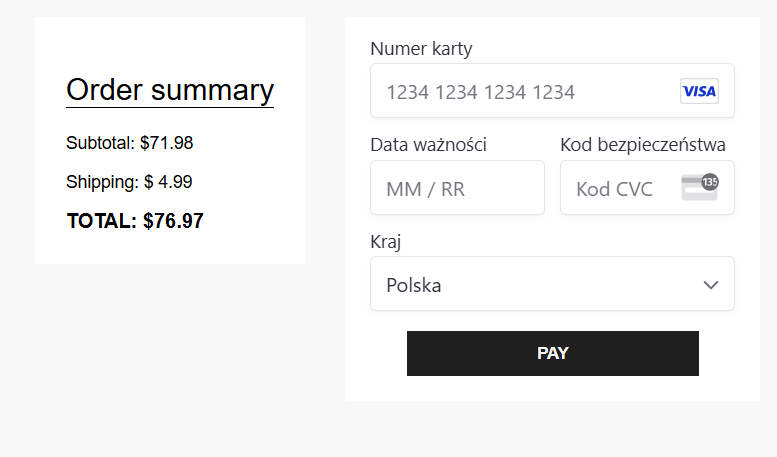
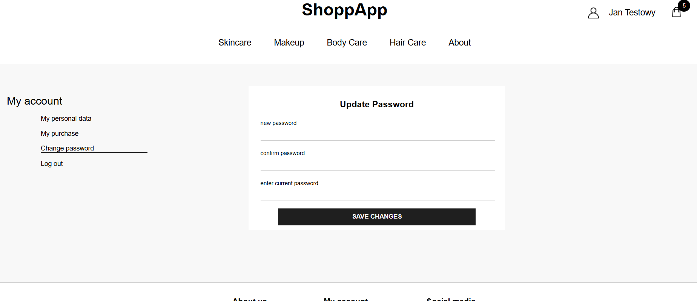
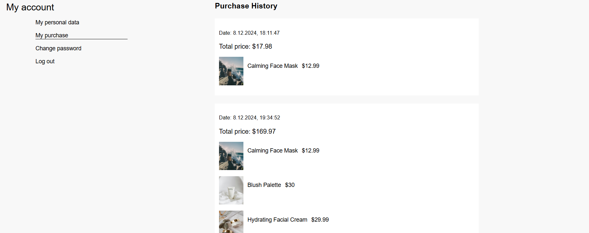

# ShoppApp

ShoppApp is a web application that provides an effortless shopping experience for users. With a shopping cart management, intuitive navigation, and secure payment processing through Stripe, ShopApp makes online shopping easy and enjoyable.

<p align="center">
  
</p>

## Installation

- The project uses node and npm. To run the app on your machine you should install all dependencies.

```bash
npm i
```

- To run a server follow the steps below

Navigate to the server directory:

```bash
cd server
```

Once you're in the server directory, run the command to start your server:

```bash
node server.js
```

After running the command, your server is ready at port http://localhost:4242

- To create a localhost port you should follow the steps below

Navigate to the client directory:

```bash
cd client
```

Once you're in the client directory, run the following command:

```bash
npm start
```

ShoppApp is ready at port 3000.

```bash
http://localhost:3000/
```

## Managing API keys

- Stripe key

The secret Stripe key is used to authenticate server-side requests to Stripe.
The .env file stores the secret key.

Example env file:

```bash
STRIPE_SECRET_API_KEY=stripe-secret-key
```

- Firebase Admin SDK key.json

The key.json file contains credentials for the Firebase Admin SDK, which allows the server to interact with Firebase securely.

Both the secret Stripe key and the key.json file should be stored in the root of the server directory.

## Solutions provided in the app

- The app handles payment transactions - for this purpose Stripe was integrated.
  The server includes an endpoint to create payment intents. This endpoint securely handles the secret Stripe key and creates a payment intent with the specified amount.

<p align="center">
  
</p>

- User panel enables updating password and personal data. It also provides viewing purchase transactions.
<p align="center">
  
</p>

<p align="center">
  
</p>

- The app is responsive, ensuring a smooth shopping experience on every devices.
  Clear, straightforward navigation and layout make it easy for users to find and purchase products.
  Users can quickly view their cart contents without leaving the current page.

<p align="center">
  
</p>

<p align="center">
  
</p>

- In ShopApp, all form fields are dynamically rendered to provide a flexible and maintainable user interface. This approach allows for easy updates and consistency across different forms in the application.

```bash
  const allFields = fields.userPanel.map((field) => (
    <Input
      key={field.id}
      field={field}
      handleFieldChange={(e) => handleFieldChange(e)}
      state={userDataState}
      setState={setUserDataState}
    />
  ));

  const allRegisterFields = fields.registerForm.map((field) => (
    <Input
      key={field.id}
      field={field}
      handleFieldChange={(e) => handleFieldChange(e)}
      state={registerState}
      setState={setRegisterState}
    />
  ));
```

- ShopApp uses Firebase for various backend services, enhancing the app's functionality.

Firebase Firestore is used to store and sync user data, ensuring real-time updates across the application.
Firebase Authentication manages user sign-ups, logins, and secure access to user accounts.
Firebase Hosting serves the static files of the client-side application, ensuring fast and secure delivery.
The Firebase Admin SDK enables secure server-side operations, such as managing user data and interacting with Firestore.

To handle Firebase operations more efficiently, a dedicated firebaseApi.js module is used along with actions for managing various tasks.

```bash
export const updatePassword = async (currentPassword, newPassword) => {
  const api = new FirebaseApi();
  await api.updateUserPassword(currentPassword, newPassword);
};

export const getAllProducts = (collection) => async (dispatch) => {
  const api = new FirebaseApi(collection);
  const data = await api.getAllData();
  dispatch(setProducts(data));
};
```

ShopApp includes functionality to listen to changes in user authentication state using Firebase Auth. This allows the application to respond to login and logout events, ensuring that the user interface is always up-to-date.

```bash
useEffect(() => {
    const unsubscribe = onAuthStateChanged(auth, async (currentUser) => {
      const localCart =
        JSON.parse(window.localStorage.getItem('shoppingCart')) || [];

      setUserData(localCart);
      if (currentUser) {
        setUser(currentUser);
      } else {
        setUser(null);
      }
    });

    return () => unsubscribe();
  }, []);
```

## Special thanks

Special thanks to Akademia Samouka - akademiasamouka.pl for providing me with the task.

Any remarks are welcomed.
